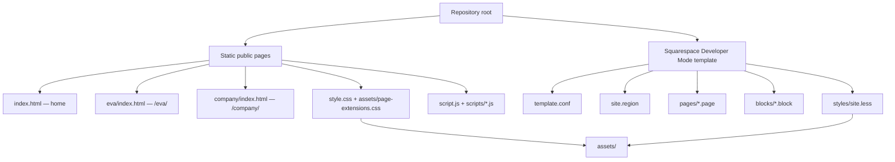
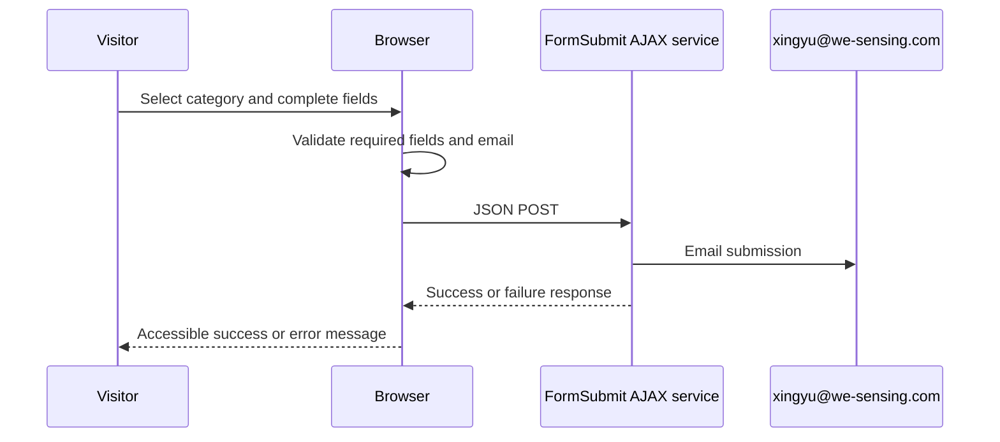

# WE-Sensing website — implementation handoff

**As-built snapshot:** 2026-08-18  
**Repository:** `wesensing/we-sensing.com`  
**Current checkout:** `codex/premium-redesign` at `9546e07`  
**Working-tree state at handoff:** clean

This document describes the website as it is currently implemented in the repository. It is the practical handoff reference for design, content, engineering, and Squarespace publishing work. Where older planning documents disagree with the code, this document identifies the difference and the code is the operational source of truth.

## 1. What has been implemented

The site now presents WE-Sensing as the parent electrochemical-sensing company, with water and wastewater monitoring as the primary business and EVA as a distinct women’s-health venture under development.

Implemented surfaces:

- A polished static homepage at `/` with water, technology, EVA preview, team preview, and contact sections.
- A dedicated EVA route at `/eva/` with EVA-specific visual treatment, product-system content, disclosures, local navigation, metadata, and partnership CTA.
- A complete Company route at `/company/` with all nine team members rendered from one central data source.
- A Squarespace Developer Mode template layer that preserves JSON-T, editable content fields, editor-controlled navigation, and the existing template deployment model.
- A static-site contact form that submits through FormSubmit to `xingyu@we-sensing.com` and a separate editor-managed Squarespace Form Block region.
- Route-specific favicon declarations: WE-Sensing for all non-EVA routes and EVA for `/eva/`.
- Replaced EVA and team visual placeholders with the PNG and WebP assets currently in `assets/`.

No DNS, CNAME, Google Workspace, Squarespace Developer Mode setting, remote connection, or production configuration has been deliberately changed by this implementation.

## 2. Product, messaging, and content guardrails

### Brand architecture

```text
WE-Sensing (parent sensing technology company)
├── Water and wastewater sensing (primary industrial focus)
└── EVA (separate women’s-health venture)
```

- Do not combine water sensing and EVA in the homepage hero.
- Preserve the corporate tagline: **“Make invisible chemistry measurable.”**
- EVA is under development and is not presented as a clinically available product.
- The exact EVA disclaimer must remain visible on the EVA page:

  > EVA is currently under development and is not available for clinical diagnosis or treatment decisions.

### Scientific and commercial claim rules

Do not add claims about performance values, detection limits, response times, customers, active commercial deployments, partnerships, patents, regulatory status, clinical outcomes, publications, institutional affiliations, or biographies unless an approved source is supplied.

In particular, do not state or imply that EVA diagnoses, treats, prevents, predicts, or replaces clinical testing. The current EVA copy uses intended-use and development language deliberately.

## 3. Architecture and deployment model

This repository supports two presentation layers that share branding, content intent, assets, and behavior patterns.



### Static layer

| Route | Entry file | Primary purpose |
| --- | --- | --- |
| `/` | `index.html` | Homepage and public contact form |
| `/eva/` | `eva/index.html` | Dedicated EVA product page |
| `/company/` | `company/index.html` | Company framing and complete team directory |

There is no package manager, build system, React app, or server-side application in this repository. Preview with:

```sh
python3 -m http.server 8000
```

Then use `/`, `/eva/`, and `/company/`. The `data-local-page` attributes in static links make direct-file preview work while preserving clean directory URLs on an HTTP server.

### Squarespace layer

| File | Responsibility |
| --- | --- |
| `template.conf` | Declares the default layout, `mainNav`/`footerNav` collections, and `site.less` |
| `site.region` | Global HTML shell, editor header/footer injection, editable main content, form and footer block fields |
| `styles/site.less` | Squarespace template/editor styles |
| `blocks/navigation.block` | JSON-T renderer for editor navigation collections, folders, active state, and external links |
| `pages/company.page` + `.conf` | Company page template and editor metadata |
| `pages/eva.page` + `.conf` | EVA page template and editor metadata |
| `blocks/company-page.block` | Squarespace version of Company page content |
| `blocks/eva-page.block` | Squarespace version of EVA page content |
| `scripts/site.js` | Keyboard-accessible Squarespace mobile navigation |

`site.region` intentionally preserves these Squarespace constructs and they must not be removed:

- `{squarespace-headers}` and `{squarespace-footers}`
- `{squarespace.main-content}`
- `<squarespace:navigation>` collections
- `data-content-field` attributes
- `contactFormBlocks` and `footerBlocks` editor block fields

### Routing and navigation ownership

- Static navigation is hand-authored in each static page and uses relative paths plus homepage anchors.
- Squarespace navigation is editor-managed through `mainNav` and `footerNav`; `blocks/navigation.block` renders it.
- In Squarespace, create or assign pages using the EVA and Company templates and set their slugs to `eva` and `company`.
- The static sitemap at `sitemap.xml` contains `/`, `/eva`, and `/company`.
- The homepage Water, Technology, and Contact destinations remain anchors; no separate static Water or Technology pages were created.

### Current deployment context

The repository audit found that the original live surface was static/GitHub Pages-style and that `main` was live at that time. The current remote is `git@github-personal:wesensing/we-sensing.com.git`. Do **not** assume the current feature branch is published. Before any release, verify the live branch and whether the static host, Squarespace Developer Mode, or both are public.

`CNAME` is a production-sensitive domain file and must remain in place.

## 4. Design system and layout principles

### Design intent

The parent site is restrained, editorial, and scientific: precise alignment, high whitespace, measured typography, technical diagrams, subtle borders, and functional animation. EVA retains this structure but uses a warmer and more human-centered expression. Avoid generic startup gradients, decorative particles, excessive cards, stock medical imagery, and unsupported scientific claims.

### Core tokens

Defined at the top of `style.css`:

| Token | Value | Use |
| --- | --- | --- |
| `--paper` | `#F6FAFA` | Parent background |
| `--deep` | `#061A24` | Dark sections and footer |
| `--ink` | `#10252E` | Primary text |
| `--muted` | `#597078` | Secondary text |
| `--aqua` | `#20C9BC` | Primary accent |
| `--blue` | `#3277F5` | Focus and secondary accent |
| `--line` | `#DCE8E8` | Borders |
| `--eva-ivory` | `#FBF5EF` | EVA background |
| `--eva-aubergine` | `#442037` | EVA dark/accent area |
| `--eva-coral` | `#DD725F` | EVA accent |

Typography is loaded from Google Fonts:

- `Manrope` — UI and body text
- `Newsreader` — editorial display type
- `DM Mono` — labels, indices, technical metadata

The main content width is `min(1320px, calc(100vw - 96px))`, reducing at tablet and mobile widths.

### Responsive behavior

The main responsive breakpoints are in `style.css` and `assets/page-extensions.css`:

| Breakpoint | Intended behavior |
| --- | --- |
| `1100px` | Compresses wide layouts and moves complex grids toward a single-column composition |
| `860px` | Activates the static mobile navigation and converts major desktop grids |
| `600px` | Mobile type, single-column cards/flows, touch-width CTA controls, simplified EVA graphics |
| Squarespace `800px` | Activates its mobile navigation treatment |

Review at 1440, 1024, 768, and 390 CSS pixels after visual changes. Do not add fixed-width media that could create horizontal overflow.

### Accessibility and interaction principles

- Semantic section headings and landmarks are used across the static pages.
- Each static page has a visible-on-focus skip link.
- Global `:focus-visible` styles use the blue accent and maintain an offset.
- Navigation toggle controls update `aria-expanded`; Escape closes both static and Squarespace mobile menus.
- Meaningful images have descriptive alternative text; decorative marks use empty `alt` attributes.
- `prefers-reduced-motion: reduce` removes or minimizes reveal transitions.
- Reveal effects use `IntersectionObserver` and degrade to immediately visible content where unsupported.

## 5. Page implementation map

### Home (`index.html`)

The homepage layout is, in order:

1. Fixed global navigation
2. Hero — parent-company positioning and fluid/electrode interface visualization
3. Core capability/credibility indicators
4. Water monitoring problem — “Water chemistry does not wait for the next sample.”
5. Workflow — “From fluid to decision.”
6. Technology stack — “A complete sensing stack, built from the electrode outward.”
7. Water applications
8. EVA preview — separate from the hero, with pad/reader/application images and a link to `/eva/`
9. Company/team preview — only the three Co-Founders, populated by the centralized renderer
10. Contact form
11. Footer

The homepage is the primary visual and messaging surface. Preserve its Water and Technology content unless change scope specifically requires otherwise.

### EVA (`eva/index.html`)

The EVA page has a warm ivory/aubergine/coral treatment under the shared parent system:

1. EVA-branded header logo and standard global navigation
2. Hero — “A familiar pad. A new layer of health insight.”
3. Required development disclaimer
4. Local EVA section navigation
5. The Need — consumer wearables, clinical testing, EVA’s intended role, and clinical-visit timeline
6. Product Design — Smart Sensing Pad, Reusable Reader, EVA Application, plus six product visual cards
7. How It Works — Use, Sense, Interpret, Understand
8. Technology — four live-text modules beside the concept image
9. Development roadmap
10. Partnerships and CTA back to `/?inquiry=eva#contact`
11. Required footer disclaimer and global footer

The local navigation, roadmap items, partnership categories, canonical URL, description, and disclaimer are centralized in `scripts/eva-content.js`. `scripts/eva-page.js` renders the local navigation, roadmap, and partner list.

### Company (`company/index.html`)

The Company page contains:

1. Global header and navigation
2. Intro hero with team-at-work image and index links to team groups
3. Complete team directory, dynamically rendered from `scripts/team-data.js`
4. Company contact CTA
5. Global footer

Do not hard-code members in the Company HTML. The team renderer owns member-card output for both the homepage preview and the Company directory.

## 6. Centralized content model

### Team data

`scripts/team-data.js` is the only source of truth for team membership, groups, roles, portraits, alternative text, and optional biographies. `scripts/team-renderer.js` resolves asset paths from the page’s `data-site-root` and renders both team views.

| Group | Members |
| --- | --- |
| Co-Founders | Dr. Xingyu Wang — Co-Founder and CEO; Dr. Baikun Li — Co-Founder; Dr. Yu Lei — Co-Founder |
| Product Team | Alyssa Sharrow — Product Design; Fritz Sonnichsen — Electronics Engineering |
| Business Team | James Towey — Business Mentor; Gregory Lewis — Business Mentor |
| Scientific Advisory Board | Katherine Burns, MD — Women’s Health and Reproductive Disease; Joel Levine, MD — Cancer Research |

All nine currently reference PNG files under `assets/team/`. No biographies are displayed because approved biographies were not provided.

To update a member, edit the single member object in `scripts/team-data.js`, confirm the asset exists, and test both `/` and `/company/`.

### EVA data

`scripts/eva-content.js` owns repeated EVA structure:

- Canonical route and metadata copy
- Required disclaimer text
- EVA local-navigation labels and anchors
- Eight roadmap stage names
- Six partnership categories

Long-form EVA copy remains duplicated between `eva/index.html` and `blocks/eva-page.block` because the repository supports both static and Squarespace rendering. Update both when changing visitor-facing EVA copy.

## 7. Images, logos, favicon, and asset management

### Current live asset usage

| Area | Current assets / implementation |
| --- | --- |
| Parent logo | `assets/logos/WE-Sensing.png` in static header/footer and Squarespace shell |
| EVA logo | `assets/logos/EVA.png` in the EVA static page header and product uses |
| Homepage EVA steps | `assets/eva/eva-pad.png`, `assets/eva/eva-logger.png`, `assets/eva/application.png` |
| EVA gallery | `eva-pad.png`, `eva-pad-back.png`, `sensing-layer.png`, `logger-detach.png`, `starterkit.png`, `application.png` |
| EVA technology visual | `assets/eva/eva-concept.png` |
| EVA hero / social visual | `assets/eva/eva-hero-product.webp`, `assets/eva/eva-open-graph.webp` |
| Parent social visual | `assets/og/we-sensing-social.jpg` |
| Team portraits | `assets/team/{lowercase-full-name}.png` |
| Team-at-work image | `assets/team/team-at-work.webp` |

Use `` and `object-fit: contain` for the current EVA product PNGs. This deliberately avoids crop, distortion, and overflow.

### Favicon implementation

Static HTML has cache-versioned PNG icon declarations:

- Home: `assets/logos/WE-Sensing.png?v=20260802`
- Company: `../assets/logos/WE-Sensing.png?v=20260802`
- EVA: `../assets/logos/EVA.png?v=20260802`

`site.region` adds WE-Sensing `icon` and `shortcut icon` links for all Squarespace pages and switches their `href` to EVA when the browser route is exactly `/eva/` or `/eva`. This runs in the document head before page rendering.

The browser can cache favicons aggressively; the query string is intentional. If the logo is replaced later, update the version token in all five declarations.

**Operational limitation:** the currently supplied logo PNGs are large horizontal wordmarks rather than square icon exports. They are valid favicon sources, but a purpose-made square favicon package (16, 32, 48, 180, and 192px) will display more clearly in browser tabs and installed shortcuts. Do not change the route logic when those files become available; only replace the assets/references.

### Asset documentation status

- `assets/asset-registry.json` is the machine-readable registry.
- `ASSET_REPLACEMENT_GUIDE.md` is the human replacement guide.
- Both still contain older placeholder wording and expected `.webp` paths for several EVA visual records even though the current code uses provided PNGs. These documents should be reconciled with the table above before the next asset-production round.
- Do not delete older assets until every reference has been migrated and tested.

## 8. Contact form and data flow

### Static homepage form

The homepage form is at `#inquiry-form` in `index.html`. It no longer uses `mailto:`.



**Endpoint:** `https://formsubmit.co/ajax/xingyu@we-sensing.com`  
**Delivery method:** FormSubmit third-party email form service  
**Credentials/API keys:** none are present in this repository or client-side code.

Submitted fields:

- Inquiry category
- Full name
- Organization (optional; “Not provided” when blank)
- Work email
- Message

Email subject logic:

```text
[Full Name] - [Organization] - Website Request
```

If organization is blank:

```text
[Full Name] - Website Request
```

`script.js` performs the following:

- HTML and JavaScript required-field validation
- Clear invalid-email guidance
- Custom `_subject` and `_replyto` payload values
- An in-page success message after accepted submission
- An in-page error message after a failed request
- Disable/lock while submitting and a per-page duplicate-send guard after success
- Honeypot field `_honey` to reduce automated spam
- EVA partnership category preselection when arriving with `?inquiry=eva`

The form intentionally asks visitors not to share personal medical information.

### Contact risks and required owner action

- FormSubmit is an external processor. Its activation, retention, spam policy, and privacy terms are not controlled by this repository. Confirm they meet the organization’s privacy and consent requirements.
- The first FormSubmit submission/activation may require confirmation by the owner of `xingyu@we-sensing.com`. Complete that confirmation before relying on live delivery.
- An end-to-end live test was intentionally not sent during implementation to avoid unsolicited test email. Submit a real, approved test after deployment and confirm delivery, reply-to behavior, success feedback, and spam handling.
- `_captcha` is set to `false`; the honeypot remains enabled. If spam becomes a problem, enable FormSubmit’s CAPTCHA or move to a controlled server-side/Squarespace form workflow.

### Squarespace contact block

`site.region` independently exposes a Squarespace editable field named `contactFormBlocks`. That is **not** wired to the static FormSubmit implementation. If the Squarespace page is the public production surface, configure its Form Block’s email/storage destinations directly in Squarespace and test it separately.

## 9. Metadata and SEO

- `index.html`, `company/index.html`, and `eva/index.html` include title, description, Open Graph, and Twitter metadata.
- `/eva/` includes an EVA-specific canonical URL, Open Graph image, Twitter image, and basic `WebPage` JSON-LD.
- `/company/` has its own canonical URL and parent-brand social image.
- `sitemap.xml` includes all three static routes.

For Squarespace, use the editor SEO fields to verify equivalent page title, description, canonical, and social image configuration. The template cannot guarantee editor metadata will be identical to static page metadata.

## 10. Operational file guide

| Change type | Primary file(s) | Required companion checks |
| --- | --- | --- |
| Homepage copy/layout | `index.html`, `style.css` | Desktop/mobile, anchors, contact form |
| Company framing copy | `company/index.html`, `blocks/company-page.block` | Sync static and Squarespace versions |
| Team members / portraits | `scripts/team-data.js`, `assets/team/` | Home preview and Company directory |
| EVA copy/layout | `eva/index.html`, `blocks/eva-page.block`, `assets/page-extensions.css` | Sync static and Squarespace versions; disclaimer |
| EVA repeated nav/roadmap/partnerships | `scripts/eva-content.js` | Local navigation and CTA targets |
| Static navigation and interactions | `script.js`, all static page headers/footers | Keyboard menu, route links, mobile behavior |
| Squarespace global shell | `site.region`, `styles/site.less`, `scripts/site.js` | Preserve JSON-T and editable fields |
| Squarespace navigation markup | `blocks/navigation.block` | Preserve JSON-T conditionals and editor control |
| Contact delivery | `index.html`, `script.js`, `style.css` | Approved live send only, validation/error paths |
| Visual asset replacement | `assets/`, registry, replacement guide | Exact static + Squarespace paths, alt text, responsive check |
| Favicon | static `<head>` files and `site.region` | Cache version, EVA route selection, hard-refresh check |

## 11. Known limitations and document debt

1. **Static vs Squarespace duplication:** EVA and Company long-form content exists in static HTML and matching `.block` files. They must be manually kept in sync.
2. **Contact workflow divergence:** static pages use FormSubmit; Squarespace relies on an editor-added Form Block. They are separate pipelines.
3. **Asset documentation lag:** `README.md`, `ASSET_REPLACEMENT_GUIDE.md`, and several registry records still describe pre-replacement CSS visualizations, old unavailable portraits, the old `mailto:` contact behavior, and an outstanding favicon package. Update these in a focused documentation reconciliation change.
4. **Favicon art direction:** current wide wordmark logo files are technically used but are not optimal square favicon art. Create dedicated square icon variants when brand assets are available.
5. **No known CMS/live configuration in repo:** this checkout does not contain the Squarespace site ID, editor database, actual production Form Block settings, developer-mode branch mapping, or deployment webhook. Production behavior must be confirmed in the platform admin.
6. **Content approvals:** confirm publication rights for team and laboratory imagery and conduct product/technical review of EVA imagery and descriptions.
7. **No automated test suite:** validation is manual/browser-based. JavaScript syntax and JSON can be checked locally, but live FormSubmit and Squarespace behavior need controlled end-to-end tests.

## 12. Quality assurance and safe publishing checklist

Before release:

1. Confirm the actual public deployment target and branch. Do not commit directly to a live branch without explicit approval.
2. Run syntax checks:

   ```sh
   node --check script.js
   node --check scripts/team-data.js
   node --check scripts/team-renderer.js
   node --check scripts/eva-page.js
   node -e "JSON.parse(require('fs').readFileSync('assets/asset-registry.json','utf8'))"
   git diff --check
   ```

3. Serve locally and inspect `/`, `/eva/`, and `/company/` at 1440, 1024, 768, and 390px.
4. Verify header logo links, static and mobile navigation, footer links, homepage anchors, EVA local links, and Company links.
5. Verify all nine team cards, names, roles, group ordering, image paths, alternative text, and portrait crop behavior.
6. Verify all EVA images load without cropping or horizontal overflow and that the development disclaimer appears near the top and footer.
7. Test keyboard navigation, focus visibility, Escape behavior for menus, skip links, and reduced-motion mode.
8. Test contact validation without sending; then perform one approved production send, completing FormSubmit activation if prompted.
9. Confirm favicon selection after deployment and a hard refresh: parent logo on Home/Company and EVA logo on `/eva/`.
10. In Squarespace, confirm the chosen pages use the intended layouts, navigation collections contain EVA/Company, and editor Form Block destinations are configured separately if that layer is published.
11. Do not remove `CNAME`, Squarespace JSON-T tags, `data-content-field` attributes, or page/block/template pairs used by the active publishing path.

## 13. Recommended next actions

1. Reconcile `README.md`, `ASSET_REPLACEMENT_GUIDE.md`, and `assets/asset-registry.json` with the current PNG-based EVA assets and FormSubmit contact workflow.
2. Confirm FormSubmit email activation and conduct an approved end-to-end delivery test to `xingyu@we-sensing.com`.
3. Confirm whether static hosting, Squarespace, or both are authoritative. Retire or document non-authoritative duplicate content only after that decision.
4. Obtain square, favicon-specific WE-Sensing and EVA icon exports; replace the wordmark files only in favicon declarations.
5. Obtain written approval for all displayed portraits and the team-at-work image.
6. Complete scientific, product, privacy, and regulatory review of EVA copy and final product imagery before a public clinical-partnership campaign.

---

For the pre-redesign forensic context and original live-branch findings, see `REPOSITORY_AUDIT.md`. For pending or replacement visual requirements, see `ASSET_REPLACEMENT_GUIDE.md` and `assets/asset-registry.json`—but use this handoff and the actual page code to resolve the current-state discrepancies noted above.
